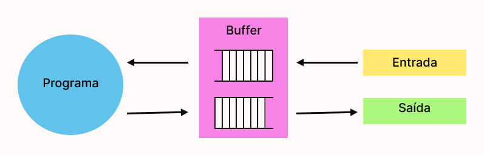

 
  <h1>Buffer</h1>

Buffer de dados é um técnica que utiliza uma parte da memória física utilizada para armazenar temporarriamente dados que estão sendo movidos de um lugar para outro. Geralmente utlizada em dispositivos de I/O para evitar que o usuário fique esperado caso tenha algum problema na leitura dos dados.

Um exemplo bem comum de buffer é a barra de carregamento de um vídeo no YouTube, aquela parte em cinza na barra mostra parte do vídeo que está carregada no buffer, sendo assim, os próximos minutos do vídeo são préviamente arazenados utilizando essa técnica com o propósito de evitar que o vídeo pare caso haja algum prblema na conexão com a internet.

   

  

    
  

   
  
#
