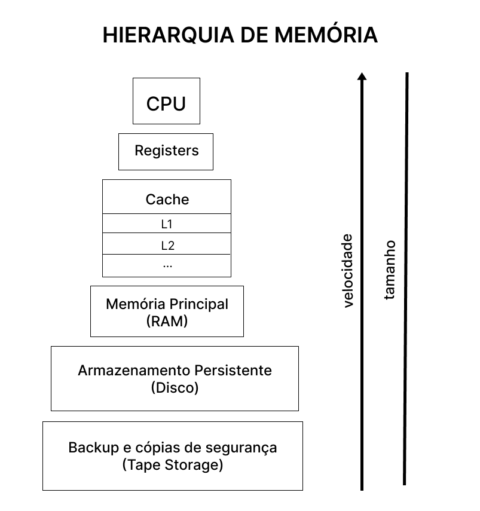
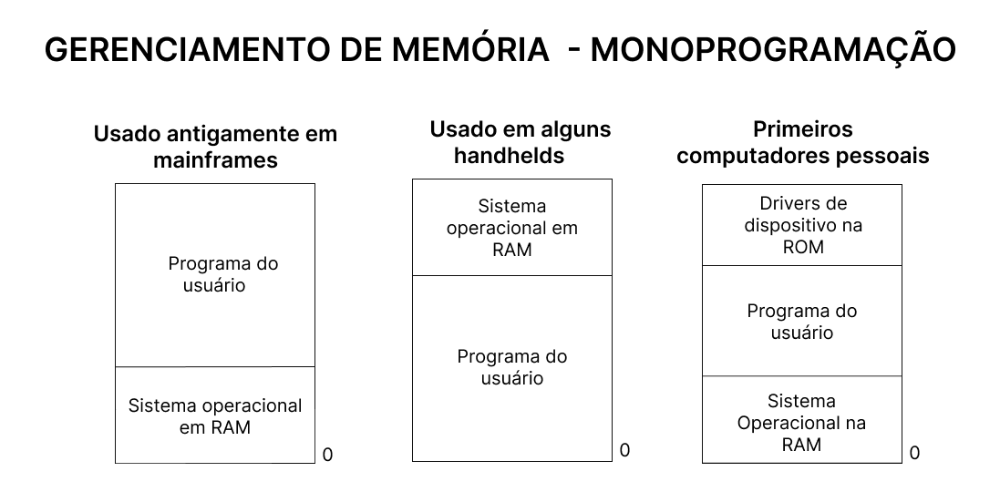
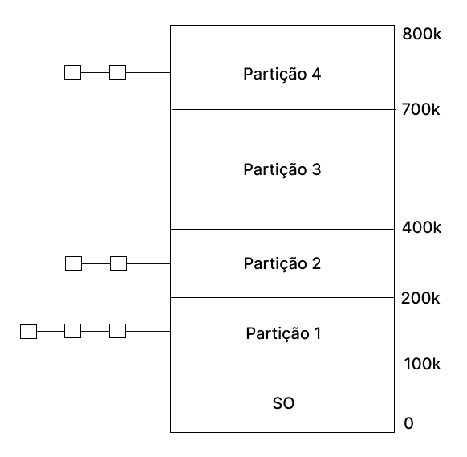
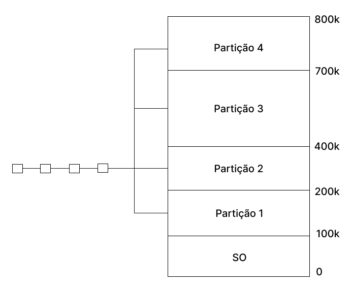

<h1>Gerenciamento de Memória</h1>

O gerenciamento de memória é realizado por um módulo do Sistema Operacional que e chama gerenciador de recursos.
A tarefa do gerencimento de memória são:

- Gerenciar a hierarquia de memória.
  - Gerenciar quais espaçoes estão livre e/ou ocupados;
  - Alocar e localizar processos/dados na memória.
- Mapear e atualizar quais partes da memória estão em uso e quais não estão para que seja possível:
  - Alocar memória para processos que estão prontos para execução;
  - Libera-la quando o processo concluir sua execução.
- Gerenciar o swapping:
  - Chaveamento entre a memória principal e o disco quando não houver espaço suficiente na memória principal para comportar todos os processos.

 

<h1>Como o Sistma Operacional administra o recurso de memória principal?</h1>

Existem diversas formas, como a monoprogramada, onde existe apenas um programa em execução, ou para casos em que há vários processos executados de forma concorrente (multiprogramada).

Um sistema de computação possui vários tipos de memórias. O grenciador de porcessos trabalha administrando os recursos da memória principal (RAM).

  

 

 

<h1>Monoprogramação sem Troca de Processos ou Paginação</h1>

Este é o esquema mais simples de gerenciamento de memória. Neste caso a memória é
compartilhada entre o sistema operacional e o programa usuário. É importante observar que a monoprogramação indica que somente um programa usuário é carregado na memória e executado por vez.

  

 

O primeiro modelo apresentado foi utilizado em computadores de grande porte (mainframe) e já não é mais utilizado. Já a segunda forma de organização ainda é utilizada em tabletes, celulares e em sistemas embarcados. A estratégia ilustrada no último modelo esteve presente nos primeiros computadores pessoais, onde a parte do sistema operacional contida em ROM é denominada BIOS.

Pelo fato de permitir que apenas um único programa usuário seja carregado em memória a cada instante, a monoprogramação raramente é usada hoje em dia, a não ser em sistemas embarcados simples.

 

<h1>Multiprogramação com Partições Fixas</h1>

Os sistemas operacionais modernos permitem que mais de um processo seja carregado em memória, de modo que quando um fica bloqueado esperando por uma operação de I/O outro, que esteja carregado em memória, poderá usar a CPU. Dessa forma, a multiprogramação ajuda a melhorar a utilização da CPU evitando desperdícios de ciclo de processamento.

Para que seja possível a multiprogramação, podemos dividir a memória em n partições (provavelmente de tamanhos diferentes). Os processos serão colocados em filas de entrada associadas à menor partição capaz de armazená-lo. Pelo fato de usarmos partições de tamanho fixo, todo o restante de espaço de memória não utilizado por ele será perdido. Este desperdício de memória é chamado de **fragmentação interna** (espaço de memória perdido dentro da área alocada ao processo). Por outro lado, imagine que exista duas partições livres, uma de 25 e outra de 100 Kbytes, não contíguas. Nesse instante é criado um processo de 110 Kbytes que não poderá ser carregado em memória pela forma como ela é gerenciada. Este problema ocasiona o que chamamos de **fragmentação externa** (memória perdida fora da área ocupada por um processo).

  

 

O problema da organização em múltiplas filas é que processos pequenos podem precisar esperar pela liberação de memória (partição mais adequada para o mesmo), embora exista memória disponível (partição grande), como é o caso da partição 1 e 3. Por outro lado, isso não ocorre no esquema de uma única fila.

  

 

Nesta organização sempre que uma nova partição é liberada o processo mais próximo
do início da fila e que caiba nessa partição pode ser carregado nela para ser executado pela CPU. No entanto, esta estratégia pode desperdiçar muito espaço ao armazenar um processo pequeno em uma partição grande. Assim, uma opção mais interessante seria pesquisar em toda a fila de entrada e alocar a partição disponível ao maior processo que pudesse ser carregado. Qual o problema dessa solução? (Discriminar processos pequenos!) Qual a solução? (Ter pelo menos uma partição pequena!). Existe uma outra possibilidade consiste em estabelecer uma quantidade máxima k de vezes que um processo pudesse ser excluído da escolha de receber uma partição. Assim, sempre que ele fosse preterido teria seu contador incrementado e, ao chegar em k vezes, ele teria que receber uma partição.

 

<h1>Alocação contigua simples</h1>

Foi Implementada nos primeiros Sistemas Operacionais e ainda existe em alguns sistemas monoprogramáveis. Nesse tipo de organização a Memória principal é dividida em duas partes, Sistema Operacional e programa do usuário.

Nesse esquema o programador tem controle sobre toda a memória principal, podendo acessar qualquer posição da memória, inclusive onde está o Sistema Operacional. Para proteger o sistema desse tipo de acesso que pode ser intencional ou não, alguns sistemas implementam proteção através de um registrador que delimita as áreas do SO e do usuário. Dessa forma sempre que um programa faz referência a um endereço na memória o sistema verifica se o endereço está dentro dos limites permitidos, caso não esteja o programa é cancelado e é mostrado uma mensagem de erro indicando que houve violação de acesso na memória principal. Ela tem Fácil implementação e código reduzido, porém é Ineficiente no uso do processador e da memória pois apenas um usuário pode dispor desse recurso.

 

<h1>Técnicas de overlay</h1>

Na alocação contigua simples todos os programas estão limitados ao tamanho da memória principal disponível para o usuário. Uma solução encontrada para o problema é dividir o programa em módulos, de forma que seja possível a execução independente de cada modulo, utilizando a mesma área da memória, essa técnica é chamada de overlay. A definição das áreas de Overlay é de responsabilidade do programador através de comandos específicos da linguagem utilizada.

 

<h1>Alocações Particionadas Estática e Dinâmica</h1>

Em sistemas multiprogramados, a memória primária é dividida em blocos chamados de partições. Inicialmente, as partições, embora de tamanho fixo, não tinham necessariamente o mesmo tamanho entre elas, possibilitando diferentes configurações para sua utilização. Este esquema é conhecido como alocação particionada estática e tinha como grandes problemas:

O fato de os programas, normalmente, não preencherem totalmente as partições onde eram carregados, desperdiçando espaço.
Se um programa fosse maior do que qualquer partição livre, ele ficaria aguardando uma que o acomodasse, mesmo se existisse duas ou mais partições adjacentes que, somadas, totalizassem o tamanho do programa. Este tipo de problema, onde pedaços de memória ficam impedidos de serem usados por outros programas, é chamado de fragmentação.

Dado o problema da fragmentação na alocação particionada estática, foi necessário outro tipo de alocação como solução e, consequentemente, o aumento do compartilhamento da memória. Na alocação particionada dinâmica, foi eliminado o conceito de partições de tamanho fixo. Nesse esquema, cada programa utilizaria o espaço que necessitasse, passando esse bloco a ser sua partição. A princípio, o problema da fragmentação pareceu estar resolvido, porém, neste caso, a fragmentação começará a ocorrer, realmente, quando os programas forem terminando e deixando espaços cada vez menores na memória, não permitindo o ingresso de novos programas. A complexidade do algoritmo de desfragmentação e o consumo de recursos do sistema, como processador e área em disco, podem tornar este processo inviável. É importante perceber que, nesses dois tipos de gerenciamento de memória apresentados, o espaço de endereçamento é igual ao tamanho da memória primária existente no sistema.

 

<h1>Diferença na fragmentação interna e externa</h1>

A fragmentação interna é a perda de espaço dentro de uma área de tamanho fixo.
A fragmentação externa ocorre no particionamento dinâmico. Ela começa a acontecer quando os programas forem terminando e deixando espaços cada vez menores na memória, não permitindo o ingresso de novos programas.

 

<h1>Estratégias de alocação de Partição</h1>

Os SO implementam basicamente 3 estrategias para determinar em qual área livre um programa sera carregada para execução. Tem como função evitar ou diminuir o problema de fragmentação externa.

- **Best-fit** Nessa estratégia é escolhida a melhor partição, ou seja, aquela que o programa deixa o menor espaço sem utilização. Nesse algoritmo a Lista de áreas livres esta alocada por tamanho, diminuindo o tempo de busca. Tem a Desvantagem de deixar pequenas áreas não contíguas, aumentando o problema da fragmentação.

- **Worst-fit** Nessa estratégia é escolhida a pior partição, ou seja, aquela que o programa deixa o maior espaço sem utilização. Ela Diminui o problema de fragmentação, deixando espaços livres maiores que permitem a um maior número de programas utilizar a memória.

- **First-fit** Nessa estratégia é escolhida a primeira partição livre de tamanho suficiente para carregar o programa. Nesse algoritmo a Lista de áreas livres ordenada por endereços crescentemente. Existe uma Grande chance de se obter uma grande partição livre nos endereços de memórias mais altos. Das 3 estratégias é a Mais rápida e consome menos recursos do sistema.

 

<h1>A técnica de Swapping</h1>

O swapping é uma técnica criada na tentativa de melhorar o problema da insuficiência de memória durante a execução de alguns processos em ambientes multiprogramados. O sistema escolhe um programa residente, que é levado da memória para o disco (swap out), retornando posteriormente para a memória principal (swap in) como se nada tivesse ocorrido.

Para que essa técnica seja implementada é necessário que o sistema ofereça um loader que implemente a relocação dinâmica de programas. Um loader realocável que não ofereça essa facilidade permite que um programa seja colocado em qualquer posição da memória, porém a realocação é realizada no momento do carregamento.
No caso do swapping, um programa pode sair e voltar diversas vezes para a memória, sendo necessário que a relocação seja realizada pelo loader a cada carregamento.

 

<h1>Realocação Dinâmica</h1>

é Realizada através de um registrador especial denominado registrador de alocação, que recebe o endereço inicial da região da memória que o programa irá ocupar no momento do carregamento do programa na memória.
Toda vez que ocorrer uma referência a algum endereço, o endereço contido na instrução será somado ao conteúdo do registrador, gerando assim, o endereço físico.

O conceito de swapping permite um maior compartilhamento da memória
principal. Mas Seu maior problema é o elevado custo das operações de entrada/saída
(swap in/out). Em momentos em que há pouca memória disponível, o sistema
pode ficar quase que dedicado à realização de swapping, deixando de
executar outras tarefas. Essa situação e chamada de Thrashing.

#
