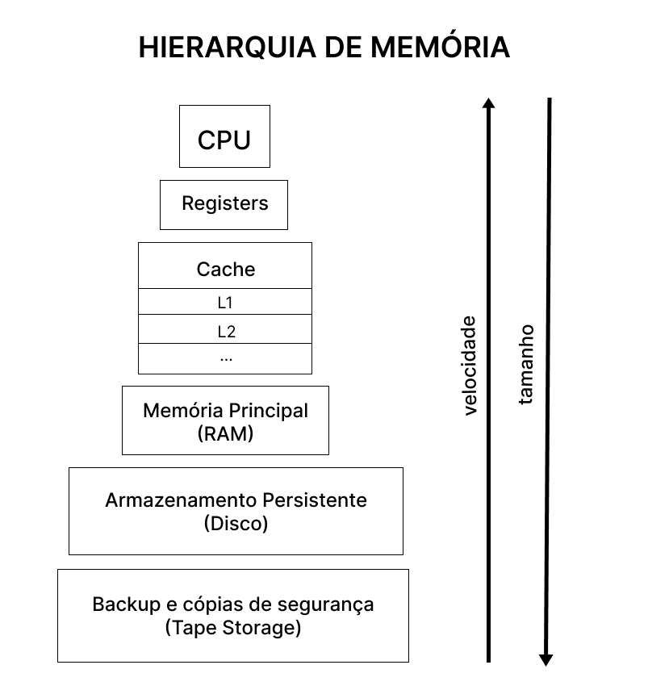

<h1>Gerenciamento de Memória</h1>

O gerenciamento de memória é realizado por um módulo do Sistema Operacional que e chama gerenciador de recursos.
A tarefa do gerencimento de memória são:

- Gerenciar a hierarquia de memória.
  - Gerenciar quais espaçoes estão livre e/ou ocupados;
  - Alocar e localizar processos/dados na memória.
- Mapear e atualizar quais partes da memória estão em uso e quais não estão para que seja possível:
  - Alocar memória para processos que estão prontos para execução;
  - Libera-la quando o processo concluir sua execução.
- Gerenciar o <a href="#swapping">swapping</a>:
  - Chaveamento entre a memória principal e o disco quando não houver espaço suficiente na memória principal para comportar todos os processos.

 

<h1>Unidade de Gerência de Memória</h1>

A MMU(Memory Management Unit) é um módulo de hardware que faz o mapeamento entre os endereços lógicos (end. da memória virtual) e os endereços físicos da memória (RAM), ou seja, é um dispositivo que transforma endereços virtuais em endereços físicos. Para isso, a MMU normalmente traduz número de páginas virtuais para número de páginas físicas utilizando uma cache chamada Translation Lookaside Buffer (TLB).

 

<h1>Como o Sistma Operacional administra o recurso de memória principal?</h1>

Existem diversas formas, como a monoprogramada, onde existe apenas um programa em execução, ou para casos em que há vários processos executados de forma concorrente (multiprogramada).

Um sistema de computação possui vários tipos de memórias. O grenciador de porcessos trabalha administrando os recursos da memória principal (RAM).

  

 

 

<h1>Monoprogramação sem Troca de Processos ou Paginação</h1>

Este é o esquema mais simples de gerenciamento de memória. Neste caso a memória é
compartilhada entre o sistema operacional e o programa usuário. É importante observar que a monoprogramação indica que somente um programa usuário é carregado na memória e executado por vez.

  

 

O primeiro modelo apresentado foi utilizado em computadores de grande porte (mainframe) e já não é mais utilizado. Já a segunda forma de organização ainda é utilizada em tabletes, celulares e em sistemas embarcados. A estratégia ilustrada no último modelo esteve presente nos primeiros computadores pessoais, onde a parte do sistema operacional contida em ROM é denominada BIOS.

Pelo fato de permitir que apenas um único programa usuário seja carregado em memória a cada instante, a monoprogramação raramente é usada hoje em dia, a não ser em sistemas embarcados simples.

 

<h2>Alocação contigua simples</h2>

Foi Implementada nos primeiros Sistemas Operacionais e ainda existe em alguns sistemas monoprogramáveis. Nesse tipo de organização a Memória principal é dividida em duas partes, Sistema Operacional e programa do usuário.

Nesse esquema o programador tem controle sobre toda a memória principal, podendo acessar qualquer posição da memória, inclusive onde está o Sistema Operacional. Para proteger o sistema desse tipo de acesso que pode ser intencional ou não, alguns sistemas implementam proteção através de um registrador que delimita as áreas do SO e do usuário. Dessa forma sempre que um programa faz referência a um endereço na memória o sistema verifica se o endereço está dentro dos limites permitidos, caso não esteja o programa é cancelado e é mostrado uma mensagem de erro indicando que houve violação de acesso na memória principal. Ela tem Fácil idispormplementação e código reduzido, porém é Ineficiente no uso do processador e da memória pois apenas um usuário pode desse recurso.

 

<h2>Técnicas de overlay</h2>

Na alocação contigua simples todos os programas estão limitados ao tamanho da memória principal disponível para o usuário. Uma solução encontrada para o problema é dividir o programa em módulos, de forma que seja possível a execução independente de cada modulo, utilizando a mesma área da memória, essa técnica é chamada de overlay. A definição das áreas de Overlay é de responsabilidade do programador através de comandos específicos da linguagem utilizada.

 

<h1>Multiprogramação com Partições Fixas</h1>

Os sistemas operacionais modernos permitem que mais de um processo seja carregado em memória, de modo que quando um fica bloqueado esperando por uma operação de I/O outro, que esteja carregado em memória, poderá usar a CPU. Dessa forma, a multiprogramação ajuda a melhorar a utilização da CPU evitando desperdícios de ciclo de processamento.

Para que seja possível a multiprogramação, podemos dividir a memória em n partições (provavelmente de tamanhos diferentes). Os processos serão colocados em filas de entrada associadas à menor partição capaz de armazená-lo. Pelo fato de usarmos partições de tamanho fixo, todo o restante de espaço de memória não utilizado por ele será perdido. Este desperdício de memória é chamado de **fragmentação interna** (espaço de memória perdido dentro da área alocada ao processo). Por outro lado, imagine que exista duas partições livres, uma de 25 e outra de 100 Kbytes, não contíguas. Nesse instante é criado um processo de 110 Kbytes que não poderá ser carregado em memória pela forma como ela é gerenciada. Este problema ocasiona o que chamamos de **fragmentação externa** (memória perdida fora da área ocupada por um processo).

  

 

O problema da organização em múltiplas filas é que processos pequenos podem precisar esperar pela liberação de memória (partição mais adequada para o mesmo), embora exista memória disponível (partição grande), como é o caso da partição 1 e 3. Por outro lado, isso não ocorre no esquema de uma única fila.

  

 

Nesta organização sempre que uma nova partição é liberada o processo mais próximo do início da fila e que caiba nessa partição pode ser carregado nela para ser executado pela CPU. No entanto, esta estratégia pode desperdiçar muito espaço ao armazenar um processo pequeno em uma partição grande. Assim, uma opção mais interessante seria pesquisar em toda a fila de entrada e alocar a partição disponível ao maior processo que pudesse ser carregado. Qual o problema dessa soluçã (Discriminar processos pequenos!) Qual a solução? (Ter pelo menos uma partição pequena!). Existe uma outra possibilidade consiste em estabelecer uma quantidade máxima k de vezes que um processo pudesse ser excluído da escolha de receber uma partição. Assim, sempre que ele fosse preterido teria seu contador incrementado e, ao chegar em k vezes, ele teria que receber uma partição.

 

<h1>Multiprogramação com Partições Dinâmica/Variáveis</h1>

  

 

Neste esquema de organização a quantidade e o tamanho dos processos na memória podem variar com o passar do tempo, o tamanho das partições é ajustado dinamicamente às necessidades exatas dos processos. como na figura o funcionamento deste algoritmo, considerando a ocorrência de swapping. Inicialmente, só o processo A está alocado na memória e com o passar do tempo os processos B, C, D e E também são carregados. Diferentemente do esquema de partição fixa, na multiprogramação com partições variáveis a o tamanho e a localização dos processos variam a medida que o mesmo deixa e retorna à memória. Uma das grandes vantagens desta estratégia é que a flexibilidade obtida melhora bastante a utilização da memória, evitando desperdícios de espaço. Por outro lado, a gerência dos espaços vazios é mais complicada, bem como a alocação e liberação das partições. O sistema operacional mantém uma lista de espaços livres na memória física. Sempre que um novo processo é criado esta lista é percorrida e será usada uma lacuna maior ou igual ao tamanho do processo em questão. O espaço que ultrapassar o tamanho do processo pode dar origem a uma nova partição. Existem algumas formas de percorrer esta lista:

1. **First-fit:** inicia a procura a partir da primeira página de memória (parte baixa) e vai varrendo a memória até encontrar a primeira lacuna suficientemente grande para armazenar o processo.
2. **Best-fit:** varre toda a memória e escolhe a página mais ajustada ao tamanho do processo.
3. **Worst-fit:** varre toda a memória e escolhe a página menos ajustada ao tamanho do processo.
4. **Next-fit:** segue a mesma idéia do first-fit, mas somente a primeira busca é iniciada na parte baixa da memória (primeira página), as outras iniciam onde terminou a última. Usa-se uma lista circular para permitir que, eventualmente, toda a memória seja percorrida.

Existe a possibilidade de formar buracos por toda a memória ao longo da execução dos processos, o que não é desejável. Uma das formas de eliminar tais buracos é mover todos os processos para a parte mais baixa da memória. Tal técnica é conhecida como **compactação de memória**. No entanto, perde-se muito tempo de processamento para promover esta organização, logo não é adequado realizar esta tarefa constantemente.

Algumas linguagens de programação permitem que a área de dados alocados por um processo cresça ao longo de sua execução. Com isso, ocorrerão problemas sempre que um processo necessita crescer e sua partição não permita nenhuma expansão. Se houver algum espaço adjacente ao processo que puder ser alocado a ele, o crescimento será permitido sem que seja necessário mover o mesmo para outra partição maior. Caso não haja espaço para aumentar o tamanho da partição ou não tenha uma partição grande o suficiente para realocar o processo, então um ou mais processos deverão ser removidos para o disco (swapping). Caso a área de swapping já esteja cheia e não seja possível realizar o chaveamento entre a memória principal e o disco o processo que deseja crescer deverá esperar ou ser eliminado.

  

 

<h1>Gerência de Memória com Mapeamento de Bits e Lista Ligada</h1>

- <h2>Mapeamento de Bits</h2>

Nesta forma de gernciamento, a cada unidade de alocação da memória é atribuido um bit para dizer se a posição está livre ou ocupada. Assim, o conjunto de todos os bits é representado em uma tabela, denominada mapa de bits, que mapeia todas as posições de memória dizendo o estado de cada uma. Devemos ressaltar que o tamanho da unidade de alocação é muito importante e quanto menor as unidades, maior será o mapa de bits. Como o mapa de bits também é armazenado em memória seu tamanho ocupará espaço útil e, consequentemente, uma parte da memória será desperdiçada. Quando um processo de k bits necessitar ser armazenado em memória a MMU deverá procurar no mapa k bits consecutivos indicando que a posição está vazia (pode ser o bit 0 ou 1). Como varrer o mapa de bits é lento este método quase não é usado.

  

 

- <h2>Lista Ligada</h2>

As representações dos espaços livres e ocupados são feitos através de uma lista ligada, onde P indica uma região ocupada por um processo e H um espaço livre de memória. A lista pode estar ordenada por endereços de memória. Assim como no mapa de bits, qualquer alteração nas posições de memória deve gerar uma alteração no mapeamento promovido pela lista ligada. Se a lista estiver ordenada por endereço uma atualização mais rápida é permitida sempre que um processo terminar de executar suas instruções ou for retirado da memória. A utilização de uma lista duplamente encadeada facilita no processo de atualização da mesma.

  

 

#

<h2 id="swapping">Sobre a técnica de Swapping</h2>

O swapping é uma técnica criada na tentativa de melhorar o problema da insuficiência de memória durante a execução de alguns processos em ambientes multiprogramados. O sistema escolhe um programa residente, que é levado da memória para o disco (swap out), retornando posteriormente para a memória principal (swap in) como se nada tivesse ocorrido.

Para sua implementação é necessário que o sistema ofereça um loader que implemente a relocação dinâmica de programas. Um loader realocável que não ofereça essa facilidade permite que um programa seja colocado em qualquer posição da memória, porém a realocação é realizada no momento do carregamento.
No caso do swapping, um programa pode sair e voltar diversas vezes para a memória, sendo necessário que a relocação seja realizada pelo loader a cada carregamento.

A **Realocação Dinâmica** é Realizada através de um registrador especial denominado **registrador de alocação**, ele recebe o endereço inicial da região da memória que o programa irá ocupar no momento do carregamento do programa na memória.
Toda vez que ocorrer uma referência a algum endereço, o endereço contido na instrução será somado ao conteúdo do registrador, gerando assim, o endereço físico.

O conceito de swapping permite um maior compartilhamento da memória principal. Mas Seu maior problema é o elevado custo das operações de I/O. Em momentos em que há pouca memória disponível, o sistema pode ficar quase que dedicado à realização de swapping, deixando de executar outras tarefas. Essa situação e chamada de **Thrashing**.

#

https://www.youtube.com/watch?v=Q8ZqjEafmNc&t=827s  
http://professor.pucgoias.edu.br/SiteDocente/admin/arquivosUpload/17785/material/AULA%2013%20-%20Gerncia%20de%20Memria.pdf
