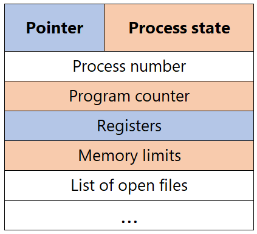
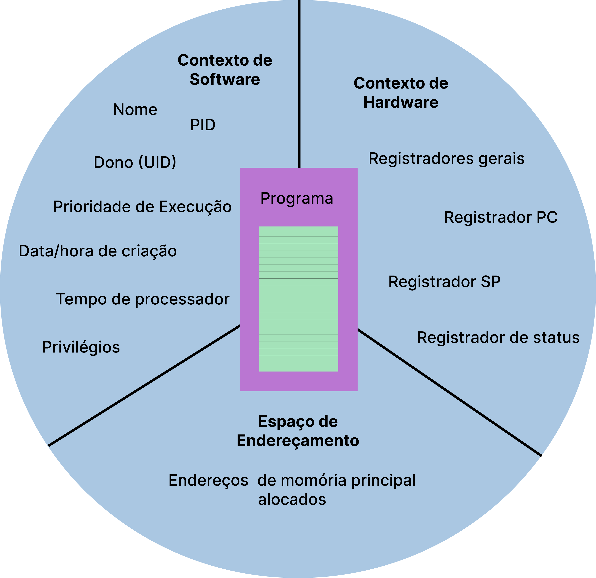

<h1>O que é um processo?</h1>   
Um processo pode ser considerado como um programa em execução e também um conjunto de informações necessárias para a concorrência de programas no sistema operacional. Além disso, também pode ser entendido como o ambiente onde um programa é executado.

<h2>Como é feita a criação e Eliminação de Processos?</h2>

Processos são criados e eliminados o tempo todo pelo sistema operacional.

- A **criação** de um processo ocorre quando o sistema operacional adiciona um novo **Process Control Block** (PCB) a sua estrutura e aloca um espaço de endereçamento na memória para uso.
  A partir da criação do PCB o sistema operacional já reconhece a existência do processo. Desde então é possível gerenciar o processo e associar ao seu contexto um programa para ser executado.

**Process Control Block**  
 

- A **eliminação** de um processo desaloca todos os recursos associados ao processo e remove o PCB criado para ele.

#

<h2>Existem dois estados adicionais para representar a criação e eliminação de processos.</h2>

**Criação (new)** - Um processo é dito no estado e criação quando o sistema operacional já criou um novo PCB, porém ainda não pode colocá-lo na lista de processos do estado pronto. Alguns sistemas operacionais limitam o número de processos ativos em função de recursos disponíveis ou de desempenho. Por isso, os processos criados permanecem no estado de criação até que possam ser colocados no estado pronto quando ficam ativos e aguardando para serem executados.

**Terminado (exit)** - Um processo no estado de terminado não poderá mais ter nenhum programa executado no seu contexto nem ter nenhum recurso alocado, no entanto, o sistema operacional ainda mantém informações do processo em memória. O processo no estado terminado não é mais considerado ativo.

#

<h1>Estrutura de um processo</h1>

    
      

Todo processo é formado por três partes:

<h2>O Contexto de hardware</h2>

Essa parte do processo é a que armazena o conteúdo dos registradores gerais da CPU e dos registradores específicos. O contexto de hardware de um processo em execução fica armazenado nos registradores do processador, no momento em que o processo perde a utilização da CPU, o sistema salva as informações no contexto de hardware do processo.

<h2>O Contexto de software</h2>

Aqui temos as especificidades dos recursos disponíveis para serem alocados em um processo, como limite de arquivos abertos ao mesmo tempo, tamanho do buffer para operações de E/S e prioridade de execução de processos.
No contexto de software temos três tipos de informação sobre o processo:

- **Identificação**
  Cada processo do sistema operacional possui um número identificador, chamado de PID (process identification), juntamente com a identificação do usuário que o criou, o UID (user identificação).

- **Quotas**
  São informação dos limites de recurso que o processo pode alocar.

- **Privilégios**
  Os privilégios definem quais ações um processo pode tomar com relação a ele mesmo, a outros processo e ao sistema operacional.

<h2>Espaço de Endereçamento</h2>

O espaço de endereçamento é a área de memória pertencente ao processo em que instruções e dados do programa são armazenados para execução. Cada processo possui seu próprio espaço de endereçamento que é protegido pelo sistema operacional para que não haja acesso pelos demais processos em execução.

#

<h1>Estados de um Processo</h1>

Em um sistema multi programado, os processos passam por vários estados durante a sua execução, em função de eventos gerados pelo sistema operacional ou pelo próprio processo.

Um processo ativo pode encontrar-se em um de três diferentes estados:

- **Execução (Running)** - Quando o processo está em execução pela UCP.

- **Pronto (Ready)** - Quando o processo aguarda para ser executado. O sistema operacional determina a ordem e o critério para que um processo em estado de pronto possa ter acesso ao processador (escalonamento de processos).

- **Espera (wait)** - Quando o processo aguarda um evento externo ou por algum recurso para prosseguir seu processamento. Por exemplo, o término da gravação de um arquivo ou a espera de determinada hora para iniciar a execução.

<h2>Mudanças de Estado de um Processo</h2>

Um processo muda de estado durante seu processamento em virtude de eventos gerados pelo sistema operacional ou pelo próprio processo. Existem quatro mudanças de estado que podem ocorrer a um processo:

- **Pronto -> Execução** - Após ser criado o processo é colocado em uma lista de execução em estado de pronto onde fica aguardando sua vez de ser executado.

- **Execução -> Espera** - Um estado em execução passa para o estado de espera por eventos externos ou por eventos gerados pelo próprio processo. Por exemplo, uma operação de entrada/saída.

- **Espera -> Pronto** - Um processo em espera passa para o estado de pronto quando o recurso solicitado é concedido ou quando a operação solicitada é concluída. Um estado em espera sempre terá que voltar ao estado de pronto antes de prosseguir sua execução. Nenhum processo em espera passa diretamente para execução.

- **Execução -> Pronto** - Um processo em execução passa para o estado de pronto por eventos gerados pelo sistema, como o término da fatia de tempo que o processo possui para sua execução.

#

<h1>Swapping de Processos</h1>

**swap==troca**  
Um processo em estado pronto ou de espera pode nao estar na memória principal. Esta condição ocorre quando não há espaço suficiente na memória principal para todos os processos. Neste caso, o contexto do processo é salvo em memória secundária. Este mecanismo é chamado swapping e consiste em retirar processos da memória principal e os trazer de volta à memória principal, essa troca é realizada de acordo com critérios de cada sistema operacional.

#

<h1>Diferença entre Sinais e Interrupção</h1>

- **Interrupções**, são mecanismos utilizados para sinalizar à CPU a ocorrência de eventos importantes relacionados aos dispositivos periféricos e outros elementos do sistema. Durante a ocorrência da interrupção é requerido que a CPU pare momentaneamente o que está fazendo para poder atendê-la. A interrupção permite que uma unidade ganhe a atenção imediata de outra, de forma que a primeira possa finalizar sua tarefa. Exemplo do uso de interrupção é a entrada de dados atendendo a solicitação de periféricos.

- Já os **sinais**, são mecanismos que permitem notificar processos de eventos gerados pelo sistema operacional ou por outros processos. O seu uso é fundamental para a gerência de processos, além de possibilitar a comunicação e sincronização entre processos, quando um sinal é enviado a um processo, o sistema operacional interrompe o seu fluxo normal de execução. Um exemplo bem simples do uso de sinais, é quando usamos o control C para parar interromper a execução de um programa

## Referências

<a href="../Tec-ARQUITETURA_DE_SISTEMAS_OPERACIONAIS.pdf">Livro Arquitetura de Sistemas Opreacionais (4º edição) - Francis Berenger Machado e Luiz Paulo Maia</a>
https://www.youtube.com/watch?v=NWrm0sbAkdA
https://diolinux.com.br/tutoriais/o-que-e-memoria-swap.html
https://www.youtube.com/watch?v=S03EXcOkdh4
