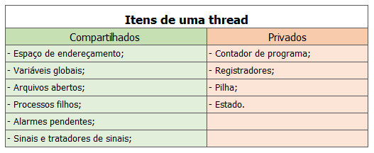

  <h1>O que é uma Thread?</h1>

Thread em inglês significa linha. Neste contexto, pode ser entendida com uma linha de execução ou sub-rotina de um programa que é executada de forma assíncrona, concorrente ao programa principal.

As threds, diferentemente dos processos compartilham o mesmo espaço de endereçamento, dessa forma, cabe ao sistema operacional cuidar para que não haja competição no uso de recursos.

Threads compartilham o processador da mesma forma que processos. Também passam por mudanças de estados (execução, espera e pronto). Por exemplo, quando uma thread espera uma operação de leitura de arquivo uma outra thread pode ser executada. Para permitir a troca de contexto de thread cada uma possui seu contexto hardware com o conteúdo dos registradores gerais, PC e SP.

  

    
  

#

  <h2>Estados de um thread</h2>

- **Pronto**, denota o estado em que só o processador é necessário.
- **Execução**, quando ela possui a CPU.
- **Bloqueado**, nesses estado eal pode estar aguardando alguma resposta de I/O, seu tem do execução pode ter acabado, pode existir outra thread chamando, tendo que ser
  escalonada e ela precise estar bloqueada ou até mesmo em virtude de algum semáforo tendo que ser colocada em espera.

#

  <h1>Ambiente Monothread</h1>

Em um ambiente monothread um processo suporta apenas um único programa em seu espaço de endereçamento. Neste ambiente os sistemas concorrentes são implementados com o uso de múltiplos processos independentes ou subprocessos.  
Com o conceito de múltiplos processos cada funcionalidade do software em execução implica na criação de um novo processo.
O problema é que quanto mais processos em execução pelo sistema operacional mais recursos são consumidos por estes processos, já que sempre que um novo processo é criado, recursos são alocados a ele. Mesmo quando um processo é finalizado, o sistema operacional dispensa tempo para desalocar os recursos que haviam sido alocados a ele. Como cada processo é independentes e tem seu próprio espaço de endereçamento a comunicação entre eles se torna mais complicada e lenta, pois utiliza mecanismos tais como troca de mensagem ou memória compartilhada. Outro problema é o compartilhamento de recursos tais como arquivos entre os múltiplos processos, cada um com seu próprio contexto de hardware, contexto de software e espaço de endereçamento.

  <h1>Ambiente Multithread</h1>

Em ambientes com multiplos threads não existe a idéia de programas associados a processos. Os programas são associados a threads. Um processo neste ambiente possui ao menos uma thread em execução e caso haja necessidade mais threads podem ser adicionadas ao mesmo processo. Neste caso o espaço de endereçamento do processo é compartilhado por todas as threads associadas a ele.  
Ao criar uma thread programador deve associa-la a uma sub-rotina que será executada por ela. É assim que em ambientes multithread se torna possível a execução concorrente de várias sub-rotinas dentro de um mesmo processo no caso de haver mais de um processador, exigindo uma carga de processamento menor do sistema operacional.  
A vantagem no uso de threads é minimizar a alocação de recursos com a criação de novos processos, também devemos lembrar que ja que as threads de um processo compartilham o mesmo espaço de endereçamento, a comunicação entre elas é feita de forma muito eficiente.

  <h1>Aplicações monothread e multithread</h1>

A grande diferença entre aplicações monothread e aplicações multithread está no uso do espaço de endereçamento. Processos são independentes e portanto cada processo possui seu próprio espaço de endereçamento, enquanto que as threads compartilham o mesmo espaço de endereçamento de um processo.
Este compartilhamento de memória permite que a troca de dados entre threads de um mesmo processo seja simples e rápida se comparado a comunicação de processos em um ambiente monothread.No entento, como threads de um mesmo processo compartilham o mesmo espaço de endereçamento é necessário garantir que uma thread não altere dados de outra thread.

#

  <h1>Tipos de Threads</h1>

  <h2>Threads em Modo usuário</h2>

São riadas através de uma biblioteca de funções fora do núcleo do sistema operacional. Neste caso as threads são implementadas pela aplicação do usuário e não pelo sistema operacional e a própria aplicação deve gerenciar a sincronização e comunicação entre as threads.

<a href="/thread/thread_java/">Exemplo de thread implementada em Java</a>

  <h2>Thread em Modo Kernel</h2>

Neste modo sua criação é feita pelo próprio núcleo do sistema operacional através de chamadas à rotinas do sistema que oferecem todas as funções para gerenciar a sincronização e comunicação das threads. Sendo assim, o sistema operacional quem cuida das threads e decide qual thread vai ser executada pelo processador em um determinado momento (escalonamento de threads).

  <h2>Thread em Modo Híbrido</h2>

Em modo híbrido as threads podem ser criadas tanto pelo sistema operacional quanto pelo usuário. Nesta implementação um processo pode ter várias threads em modo kernel e cada thread em modo kernel pode ter várias threads em modo usuário. O núcleo do sistema operacional reconhece as threads em modo kernel e pode escalona-las individualmente. No entanto, neste tipo de implementação é que não é possível a comunicação entre threads em modo usuário e threads em modo kernel.

## Referências

<a href="../Tec-ARQUITETURA_DE_SISTEMAS_OPERACIONAIS.pdf">Livro Arquitetura de Sistemas Opreacionais (4º edição) - Francis Berenger Machado e Luiz Paulo Maia</a>

https://www.youtube.com/watch?v=xNBMNKjpJzM

https://www.youtube.com/watch?v=Tbwu55Iov5s

